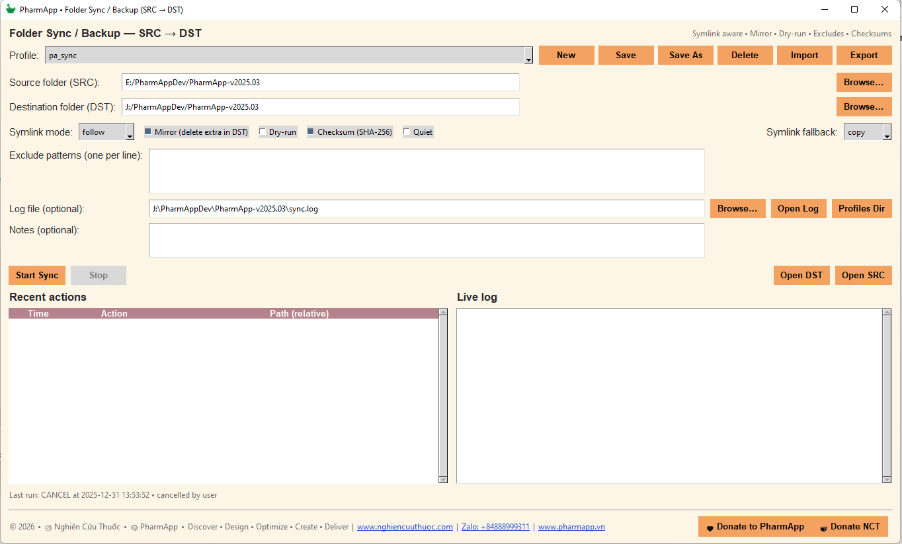

# PharmAppFolderSync

Công cụ đồng bộ thư mục (SRC → DST) dạng **GUI** nhẹ, có **quản lý profile** và **hỗ trợ symlink**.  
Xây dựng bằng Python + Tkinter/ttk theo **PharmApp 2025 theme**.

> **Mục tiêu chính:** giữ 2 thư mục “giống nhau” theo hướng **một chiều** (backup/mirror/sync) với quy trình đơn giản, có log để kiểm soát.

---

## Điểm nổi bật

- **One-way sync (SRC → DST)**, tùy chọn **Mirror** (xóa phần dư ở DST).
- **Symlink-aware**:
  - **preserve**: giữ symlink (DST tạo symlink tương tự SRC)
  - **follow**: copy nội dung thật phía sau symlink (dereference)
  - **skip**: bỏ qua symlink
- **Profiles (MVP)**: lưu nhiều cấu hình, chuyển nhanh giữa các job.
- **Dry-run**: chạy thử (không ghi dữ liệu).
- **Checksum (SHA-256)**: kiểm tra thay đổi chắc chắn hơn (chậm hơn).
- **Exclude patterns**: loại trừ theo mẫu wildcard, 1 dòng/1 pattern.
- **Logging**: log file + live log trên GUI + bảng actions gần đây.
- Thân thiện đóng gói: chạy tốt dạng **EXE onefile** (PyInstaller) và có thể đóng gói macOS app.

---

## Công cụ này dùng để làm gì (và không làm gì)

### Dùng tốt cho
- Backup thư mục dự án (dev folder → ổ backup)
- Duy trì “bản chuẩn” của folder luôn được cập nhật
- Mirror toàn bộ cây thư mục (kèm exclude)

### Không dành cho
- Đồng bộ 2 chiều (two-way sync) / merge xung đột
- Thay thế Git / version control
- Replication mạng có diff từ xa

Đây là **đồng bộ một chiều**: **SRC là nguồn sự thật**.

---

## Ảnh minh họa (khuyến nghị)





---

## Cài đặt / Tải về

### Cách A — Dùng EXE (Windows)
1. Tải file `.exe` từ mục **Releases** (nếu repo có publish).
2. Đặt `.exe` ở bất kỳ đâu.
3. Nếu build của bạn phụ thuộc icon assets, xem phần Packaging bên dưới.

### Cách B — Chạy từ mã nguồn (Python)
1. Clone repo:
   ```bash
   git clone https://github.com/nghiencuuthuoc/PharmAppFolderSync
   cd PharmAppFolderSync
   ```
2. Tạo và kích hoạt môi trường ảo:
   ```bash
   python -m venv .venv
   # Windows
   .venv\Scripts\activate
   # macOS/Linux
   source .venv/bin/activate
   ```
3. Chạy:
   ```bash
   python folder_sync_gui_v1.py
   ```

---

## Hướng dẫn nhanh (GUI)

1. **Profile**
   - Chọn profile có sẵn, hoặc bấm **New** để tạo mới.
2. Chọn thư mục:
   - **SRC**: thư mục nguồn (copy từ đây)
   - **DST**: thư mục đích (cập nhật vào đây)
3. Chọn tùy chọn:
   - **Symlink mode**
   - **Mirror**
   - **Dry-run**
   - **Checksum**
   - **Exclude patterns**
   - **Log file**
4. Bấm **Start Sync**.

---

## Profiles (cách hoạt động)

Profiles giúp bạn lưu nhiều cấu hình đồng bộ khác nhau (ví dụ “Backup dự án”, “Mirror media”, “Archive tài liệu”).

### Các nút profile
- **New**: tạo profile mới
- **Save**: lưu đè lên profile hiện tại
- **Save As**: lưu thành profile mới
- **Delete**: xóa profile
- **Import / Export**: mang profile sang máy khác (JSON)

### Nơi lưu profiles (theo user)
Để chạy tốt với EXE onefile, app lưu ở thư mục cấu hình người dùng:

- **Windows:** `%APPDATA%\PharmAppFolderSync\profiles.json`
- **macOS:** `~/Library/Application Support/PharmAppFolderSync/profiles.json`
- **Linux:** `~/.config/PharmAppFolderSync/profiles.json`

Có thể mở nhanh bằng nút **Profiles Dir**.

---

## Giải thích các tùy chọn Sync

### Symlink mode

#### 1) `preserve`
- DST sẽ tạo **symlink** tương tự như SRC.
- Hợp khi bạn muốn DST “giống cấu trúc” với SRC.

**Lưu ý Windows:** tạo symlink có thể cần quyền Admin hoặc bật Developer Mode.

#### 2) `follow` (copy nội dung thật của symlink) ✅
- App sẽ “đi theo” symlink directory và **copy toàn bộ nội dung target** sang DST.
- DST sẽ có **file/folder thật**, không còn symlink.

**Quan trọng:** nếu symlink trỏ ra ngoài cây SRC, chế độ `follow` vẫn sẽ copy theo target đó. Hãy dùng exclude để kiểm soát phạm vi.

#### 3) `skip`
- Bỏ qua symlink.
- Dùng khi muốn tránh copy folder/link trỏ ra ngoài hoặc tránh vòng lặp.

### Mirror (delete extra in DST)
- Khi bật, app sẽ **xóa** các file/folder ở DST mà **không tồn tại trong SRC** (sau khi áp dụng exclude).
- Đây là tính năng “mạnh” và có tính phá hủy—hãy dùng thận trọng.

### Dry-run
- Chạy thử, **không ghi thay đổi**.
- Khuyến nghị bật trước khi chạy thật, nhất là khi dùng Mirror.

### Checksum (SHA-256)
- So sánh hash để phát hiện thay đổi chính xác hơn.
- Chậm hơn, đặc biệt với folder lớn.
- Phù hợp để audit/đối soát sau.

### Exclude patterns
Exclude match theo **đường dẫn tương đối** dạng POSIX (dùng dấu `/`).

Ví dụ:
```text
**/.git/**
**/__pycache__/**
**/*.tmp
**/node_modules/**
**/dist/**
**/*.log
```

Mẹo:
- 1 pattern mỗi dòng
- Dòng bắt đầu bằng `#` là comment
- `**` để match nhiều cấp thư mục

---

## Logging

- Bạn có thể set **Log file**.
- Nếu để trống, app có thể default về:
  - `DST/sync.log`

Log sẽ gồm:
- Start/end summary
- Hành động: COPY/UPDATE/SKIP/DELETE
- Warning/Error

GUI cũng hiển thị live log và bảng recent actions.

---

## Ghi chú an toàn (nên đọc)

1. **Mirror có xóa dữ liệu**
   - Nên dùng **Dry-run** trước nếu chưa chắc.
2. **Symlink follow có thể copy rất rộng**
   - Symlink có thể trỏ ra ngoài SRC; `follow` sẽ copy theo target.
3. **Folder lớn**
   - Bắt đầu không checksum để nhanh; checksum chỉ bật khi cần audit.
4. **Quyền truy cập**
   - Một số file có thể copy lỗi do ACL/permissions; xem log để biết chi tiết.

---

## Build EXE onefile (Windows)

### Yêu cầu
- Python 3.10+ khuyến nghị
- PyInstaller

Cài PyInstaller:
```bash
pip install pyinstaller
```

Build EXE onefile (GUI):
```bash
pyinstaller --noconfirm --clean --onefile --windowed \
  --name PharmAppFolderSync \
  --icon "./nct_logo.ico" \
  --add-data "./nct_logo.png;." \
  folder_sync_gui_v1.py
```

Output:
- `dist/PharmAppFolderSync.exe`

---

## Gợi ý đóng gói macOS

Có thể dùng PyInstaller trên macOS, lưu ý:
- Nên dùng icon `.icns` cho app bundle
- Dùng `--add-data` để đảm bảo `nct_logo.png` có trong bundle
- Test hành vi symlink theo quyền của macOS + Gatekeeper

Ví dụ:
```bash
pyinstaller --noconfirm --clean --windowed \
  --name PharmAppFolderSync \
  --add-data "./nct_logo.png:." \
  folder_sync_gui_v1.py
```

---

## Quy trình khuyến nghị (best practice)

1. Tạo profile (ví dụ `pa_sync`)
2. Set **SRC** và **DST**
3. Thêm exclude tối thiểu: `.git`, `__pycache__`, build folders
4. Chạy **Dry-run** 1 lần
5. Tắt Dry-run, chạy thật
6. Chỉ bật **Mirror** khi bạn thực sự muốn DST là mirror đúng nghĩa

---

## Donate / Ủng hộ dự án

Nếu project giúp ích cho công việc của bạn:

- Donate NCT: https://www.nghiencuuthuoc.com/p/donate.html  
- Donate PharmApp: https://www.pharmapp.vn/Donate

---

## License

Xem file `LICENSE` trong repository.

---

## Hệ sinh thái

- Nghiên Cứu Thuốc: https://www.nghiencuuthuoc.com  
- PharmApp: https://www.pharmapp.vn
